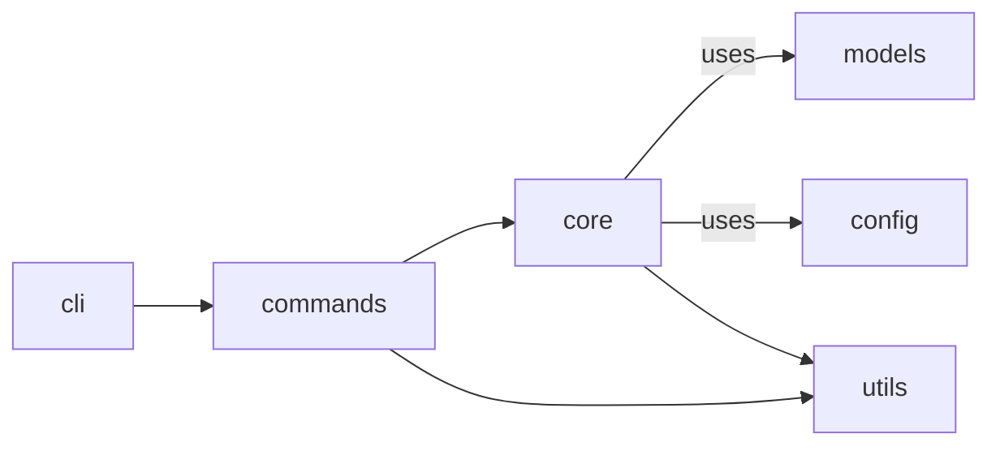

# Project architecture

This document provides a high-level tour of the **VSC Sync CLI** codebase — the main layers, their responsibilities, and how they interact.  Reading it before diving into the source will save you a lot of time.

```
src/
└─ vsc_sync/
   ├─ cli.py            ← `typer` entry-point
   ├─ commands/         ← One file per CLI sub-command
   ├─ core/             ← Pure logic; no CLI / I/O coupling
   ├─ models.py         ← Pydantic dataclasses shared everywhere
   ├─ config.py         ← Global settings + paths
   └─ utils.py          ← Small cross-cutting helpers
```

## 1. CLI layer (`src/vsc_sync/cli.py` & `commands/`)

* Built with [Typer](https://typer.tiangolo.com/) (Click-based).  Each command lives in its own module under `vsc_sync.commands`.
* Responsibilities:
  * Parse CLI arguments / options.
  * Handle user-friendly output (rich console, colours, progress bars).
  * Delegate all heavy lifting to the **core layer**.
* Absolutely **no business logic** should leak into the CLI; keep it thin.

## 2. Core layer (`src/vsc_sync/core/`)

Pure Python functions and classes that can be imported by other programs or tested without spawning a subprocess.

Modules:

| Module                | Responsibility                                        |
|-----------------------|-------------------------------------------------------|
| `file_ops.py`         | Read/write VS Code’s settings.json, extensions list, snippets, etc. |
| `git_ops.py`          | Thin wrapper around `GitPython` for clone, pull, push, branch ops |
| `config_manager.py`   | Load, merge and validate `.vsc-sync.toml` configs      |
| `app_manager.py`      | Orchestration: coordinates file + git ops for `apply`, `edit`, … |

**Key property:** the core never prints or reads from stdin — perfect for unit tests.

## 3. Models (`src/vsc_sync/models.py`)

Uses [Pydantic](https://docs.pydantic.dev/) for:

* Strongly-typed data interchange between layers.
* Validation of config files and API payloads.

These models are serialisable to JSON (and TOML via helper functions) which simplifies caching and debugging.

## 4. Config (`src/vsc_sync/config.py`)

Centralised place for:

* Default paths (`~/.config/vsc-sync/…`).
* Global constants (current version, environment variable names, exit codes).

Keeping them in one file avoids a forest of `importlib.resources.path` calls scattered around the repo.

## 5. Utilities (`src/vsc_sync/utils.py`)

Small helpers that don’t belong anywhere else: coloured logging setup, temporary-directory context managers, etc.

---

### Data flow for `vsc-sync apply`

```mermaid
flowchart TD
    subgraph CLI
        A[apply_cmd.py]
    end
    subgraph Core
        B[app_manager.apply()]
        C[file_ops.read_local()]
        D[git_ops.pull()]
        E[file_ops.write_local()]
    end

    A --> B --> C
    B --> D --> E
```

1. `apply_cmd` parses flags → calls `app_manager.apply(...)`.
2. `read_local` loads current VS Code state for diffing.
3. `git_ops.pull` ensures the dot-files repo is up-to-date.
4. `write_local` overwrites VS Code files with the latest repo version.

All error handling bubbles up to `apply_cmd`, which converts Python exceptions into exit codes and pretty messages.

---

## Dependency diagram



* **No arrow should ever point from core → commands or core → cli** — this keeps the library usable without the CLI.

---

## Testing strategy

* Unit tests target **core** functions directly for speed and determinism.
* Integration tests call the CLI via [`click.testing.CliRunner`](https://click.palletsprojects.com/en/8.1.x/testing/) to validate end-to-end behaviour.
* Fixtures in `tests/conftest.py` spin up temporary git repos & VS Code directories.

Code coverage is enforced at 90 %+ on every PR.

---

## Gotchas / foot-guns

1. **Platform paths:** Use `pathlib.Path` *everywhere*; Windows back-slashes bite hard.
2. **Environment isolation:** Tests should not touch the real `~/.vscode`.  Fixtures patch `os.environ["VSCODE_PORTABLE"]` to redirect.
3. **Long-running git ops:** Wrap them in threads; Click’s progress bar needs the main thread.

---

## Where to go next

* Browse the [API reference](../reference/vsc_sync.md) — each public function/class in core is documented there.
* Want to add a new CLI command?  Copy an existing file in `vsc_sync/commands/` and follow the patterns above.

Happy hacking! 🛠️
